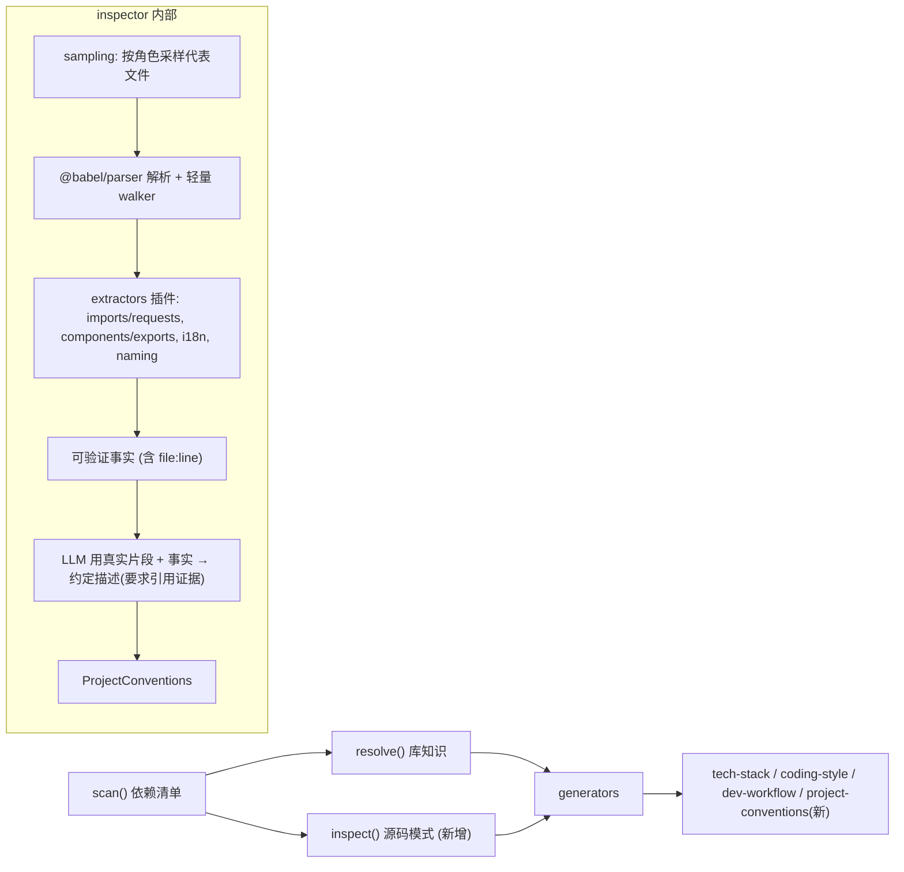

# Roadmap: 源码模式抽取(inspector 层)

> 状态:已规划,待迭代。本文件是下一阶段的方向与执行计划。

## 背景与目标

现状工具工作在**依赖清单层**:读 `package.json` → 查表/问模型 → 输出库的通用用法。
这类规则与模型已有的通用知识重合度高,信息密度有限。

**2026-06-04 自测验证**：
- 对 cursor-rules-gen 自身：6 dep → 4 known → 全部泛化约定,0 条项目自身特有规则
- 对 zcenter-ui（React monorepo, 143 dep）：21 known → 框架约束有价值（antd 3.x、react-router v5）,
  但 120+ 长尾库（echarts、react-intl、react-dnd、monaco-editor）零覆盖

结论：依赖层对"用了什么"能答，对"怎么用的"和"有什么约束"完全失明。
工具/库类项目受益最少,框架类项目在核心框架上有价值但长尾全盲。

本方向新增**源码模式层**(inspector):读真实代码,抽取**项目专属约定**,
即只有读了本项目代码才能得出、对编辑该项目有直接约束力的规则。
与依赖清单层的区别在于:前者是库通用,后者是项目特定。

可提取的约定类型(示例,均为通用类别,非特定项目):

- 数据请求方式:项目是否统一经封装的 request 工具,而非直接调用 axios/fetch。
- 目录/文件命名与结构:页面入口、组件、hooks 的命名与放置约定。
- i18n 用法:是否统一经 i18n hook(如 `useIntl` / `useTranslation`),禁止硬编码文案。

这些通过 AST 解析 + 文件采样可稳定提取。

## 已定取舍

- **范围**:先只做 **TS/React**,做深并验证产出质量,再考虑扩语言。
- **引擎**:**混合** —— AST 出确定性事实,LLM 用真实片段出约定描述并以证据兜底防幻觉。

## 架构(新增 inspector 层,复用现有插件风格)

新增模块(镜像现有 `scanner/plugins`、`resolver/static` 的插件式组织):

- `src/inspector/index.ts` — 编排:采样 → AST 事实 → LLM 增强 → `ProjectConventions`
- `src/inspector/sampling.ts` — 按角色桶(pages/components/hooks/services/layouts)挑代表文件,跳过 barrel/测试,封顶文件数与字节数
- `src/inspector/ast/parse.ts` — `@babel/parser`(plugins: `typescript`,`jsx`)+ 手写递归 walker(只加这 1 个依赖,避免 @babel/traverse 体积)
- `src/inspector/extractors/*.ts` — 插件式抽取器,实现统一 `InspectorExtractor` 接口
- `src/inspector/llm.ts` — 复用 `ChatTransport`,用真实片段做 grounded 总结,**要求每条约定引用所给文件,否则丢弃**
- `src/generators/conventions.ts` — 输出 `project-conventions.mdc`(`alwaysApply: true`,精简)

## MVP 抽取的 3 类项目专属约定(TS/React)

1. **数据请求方式**:AST 找请求 helper 的 import 来源,判定项目是否统一经封装而非直接用 axios/fetch。
2. **目录/文件命名与结构**:页面入口、hooks 文件、组件目录的命名与放置约定(采样路径 + 导出形态)。
3. **i18n 用法**:统一经 i18n hook 的程度,据此约束"文案禁止硬编码"。

附带 AST 确定性事实:函数组件 vs class、具名 vs 默认导出。

## 防幻觉与正确性

- AST 事实可验证、稳定;LLM `temperature 0`,且每条约定必须引用所给文件集中的 `file:line`,无证据则剔除。
- 生成的 `project-conventions.mdc` 每条规则后附证据路径,便于核查。

## 集成与开关

- 深度模式 **opt-in**(读源码 + LLM 有成本):CLI 加 `--deep`;扩展加命令 `Cursor Rules: Generate (Deep)` 或设置项。默认 Generate 保持快(清单级)。
- 复用现有 transport 选择(Cursor CLI 优先)、进度回调、缓存(按文件 hash 缓存抽取结果)。
- 隐私:深度模式会把真实代码片段发给模型;经 Cursor CLI 在用户 Cursor 信任边界内,使用外部 API key 时显式提示。

## 取舍点(已知成本)

- 依赖:+`@babel/parser`(bundle 增大数百 KB,可接受;只解析不 traverse)。
- 成本/延迟:深度模式更慢,故 opt-in + 采样 + 缓存。
- 确定性:LLM 约定有波动,用 temperature 0 + 证据要求缓解。

## 验证门槛(MVP 通过才做全套)

选一个代表性的 TS/React 项目跑深度模式,人工对比 `project-conventions.mdc` 与现状 `coding-style.mdc`:
若项目专属约定(请求封装/命名结构/i18n)明显更具约束价值,则继续 Phase 3/4;否则止步复盘。

## 关于 awesome-cursorrules(PatrickJS/awesome-cursorrules)的取舍

结论:**作为知识库整体引入,不值得;只挑"防坑/反幻觉"类内容手工内化。**

- 定位不同:它是技术栈通用模板(库通用层),本方向做的是项目专属抽取(项目特定层)。
- 通用层我们已能自动产出,且模板分发已有成熟目录站(cursor.directory 等)。
- 格式不兼容:它是"整文件、按栈组合",我们是"按依赖的 LibKnowledge 再组合"。
- 唯一可挖:少数版本专属、防 AI 幻觉的内容(如 Next.js Supabase Security、NestJS Anti-Hallucination)。
  做法是当**研究素材**,手工提炼若干主流库的版本坑补进静态表 `constraints`(该库为 CC0,可合法取用),
  不整体 vendor、不做模板分发。

## 已完成 (2026-06-04)

- [x] **依赖层优化 1**:翻转 resolver 链顺序 — LLM 模式改为 `cache → llm → static`（LLM 优先，静态表兜底）。静态表腐烂不再致命。
- [x] **依赖层优化 2**:新增 `SkillsDiscoveryProvider` — 扫描 `node_modules/*/skills/*/SKILL.md`（Agent Skills 标准），库维护者自己的知识最高优先级。
  - 最终链：`skills → (extra: vscode.lm) → cache → llm → static`
  - 零新依赖，~130 行新代码

## 分阶段执行计划

### Phase 0 — 配置文件提取（确定性事实）
> **目标**: 从 tsconfig / package.json / tsup.config / .vscodeignore 等配置文件中提取确定性约束，不依赖 AST 也不依赖 LLM。所有项目类型受益。
> **优先级**: 最高 — 今天自测暴露出 config-level 信息完全缺失（engines、module 系统、双输出目标等）。
> **工作量**: ~150 行，零新依赖

- [ ] 扩展 `nodeScanner.detect()` 或新增轻量 `ConfigExtractor`:
  - `package.json`: `engines` / `type` / `main` / `bin` / `activationEvents` / `contributes`
  - `tsconfig.json`: `strict` / `moduleResolution` / `target` / `paths`
  - `tsup.config.ts`: 多入口、输出格式、target
  - `.vscodeignore`: 发布文件约束
  - `pnpm-workspace.yaml`: workspace 配置细节
- [ ] 新增 `ScanResult.configConstraints` 字段或在 `ProjectMeta` 中透传
- [ ] 渲染到 `tech-stack.mdc`（Environment Constraints）和 `coding-style.mdc`（Project-Specific Rules）
- [ ] 修复 `tsc --noEmit` 重复输出问题（同一个 dep 在多处触发）

### Phase 1 — AST 骨架（TS/React）
> **目标**: 新增 inspector 层，读真实源码抽取项目专属约定。先只用 AST 确定性事实，不加 LLM。
> **新增依赖**: `@babel/parser`（~200KB bundle 增量）

- [ ] 新增类型 `InspectorExtractor`、`ProjectPattern`、`ProjectConventions`
- [ ] `src/inspector/sampling.ts` — 按角色桶选代表文件，封顶文件数/字节数
- [ ] `src/inspector/ast/parse.ts` — `@babel/parser` + 手写递归 walker
- [ ] `src/inspector/extractors/imports.ts` — 检测统一封装的请求 helper（如 `import request from '@/utils/request'`）
- [ ] `src/inspector/extractors/exports.ts` — 具名 vs 默认导出、函数组件 vs class
- [ ] `src/generators/conventions.ts` — 输出 `project-conventions.mdc`（`alwaysApply: true`）
- [ ] 选一个 TS/React 项目验证产出质量

### Phase 2 — LLM grounded 增强
> **目标**: 用 LLM 对 AST 抽取的事实做 grounded 总结。每条约定必须引用 `file:line`，无证据剔除。

- [ ] 新增 extractors: i18n 用法、目录/文件命名结构
- [ ] `src/inspector/llm.ts` — 复用 `ChatTransport`，temperature 0，防幻觉剔除
- [ ] 合并 AST 事实 + LLM 总结为 `ProjectConventions`

### Phase 3 — 接线与开关
> **目标**: pipeline 接入 inspect 步骤，opt-in 深度模式。

- [ ] `pipeline.ts` 接入 `inspect()` 步骤
- [ ] CLI 加 `--deep` 标志
- [ ] 扩展加 `Cursor Rules: Generate (Deep)` 命令
- [ ] 进度回调 + 按文件 hash 缓存抽取结果
- [ ] end-to-end 验证：对比 `project-conventions.mdc` vs `coding-style.mdc`

### Phase 4（可选）— 校验与 living
- [ ] 正确性校验（glob 是否匹配真实文件、import 是否存在）
- [ ] 约定漂移检测（manifest 对比）

### 不做的
- ~~扩充静态表~~ — 死路。Agent Skills 生态（`@tanstack/intent`）正在解决"谁维护知识"的问题。
- ~~awesome-cursorrules 整表引入~~ — 通用模板价值低，格式不兼容。只手工提炼少量版本坑补进 `constraints`。
